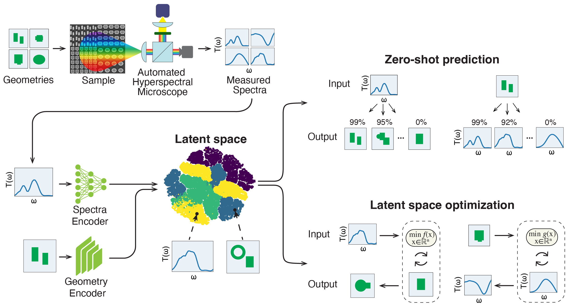

# MOCLIP: A Foundation Model for Large-Scale Nanophotonic Inverse Design

## Overview
MOCLIP (Metasurface Optics Contrastive Learning Pretrained) is a foundation model for metasurface optics design, trained using contrastive learning on a large-scale experimentally generated dataset of silicon-on-glass metasurfaces. The model was pretrained on 466,537 unique geometry–spectrum pairs, enabling joint representation learning of metasurface geometries and their corresponding polarization-resolved transmission spectra. 

Details on the dataset generation and MOCLIP training can be found in the following arxiv preprint: 
**[MOCLIP: A Foundation Model for Large-Scale Nanophotonic Inverse Design](https://arxiv.org/abs/2511.18980)**.

Alongside the pretrained model, this repository provides a 10k randomly sampled subset of the full dataset for reproducibility, experimentation, and benchmarking.